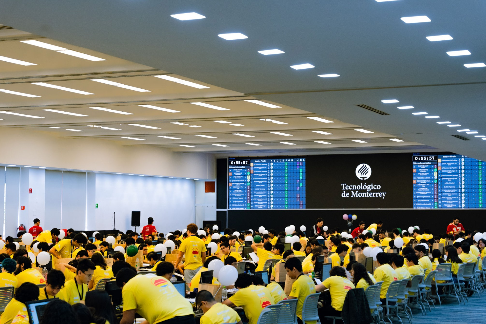

# Introducción

El **Club de Algoritmos y Programación Competitiva UAM-I** ha creado está página como un recurso para apoyar y desafiar a todos aquellos que quieran adentrarse en el mundo de la **Programación Competitiva**.

Este espacio está especialmente diseñado para preparar equipos que participen en el [ICPC](https://icpc.global/) (International Collegiate Programming Contest), la competencia de programación universitaria más prestigiosa a nivel mundial. No obstante, las habilidades adquiridas aquí también son útiles en otras competencias, asignaturas académicas, proyectos personales e incluso en la búsqueda laboral.

## Contenido
El contenido a tratar se ha divido en **3 niveles** principales:

1. [Nivel 1: Bases de Programación](./nivel_1/nivel_1.md)
2. [Nivel 2: Estructuras de Datos y Algoritmos](./nivel_2/nivel_2.md)
3. [Nivel 3: Especialización en Temas Avanzados](./nivel_3/nivel_3.md)

Los temas cubiertos en los niveles [1](./nivel_1/nivel_1.md) y [2](./nivel_2/nivel_2.md) están orientados a que los equipos desarrollen las habilidades necesarias para competir con éxito por un lugar en la **Final Regional (ICPC Mexico Finals)**.

Sin más por agregar, te invitamos a consultar el material y disfrutar cada paso en este apasionante camino de programación competitiva. Recuerda que cada problema resuelto es un paso más hacia el crecimiento personal y profesional.

