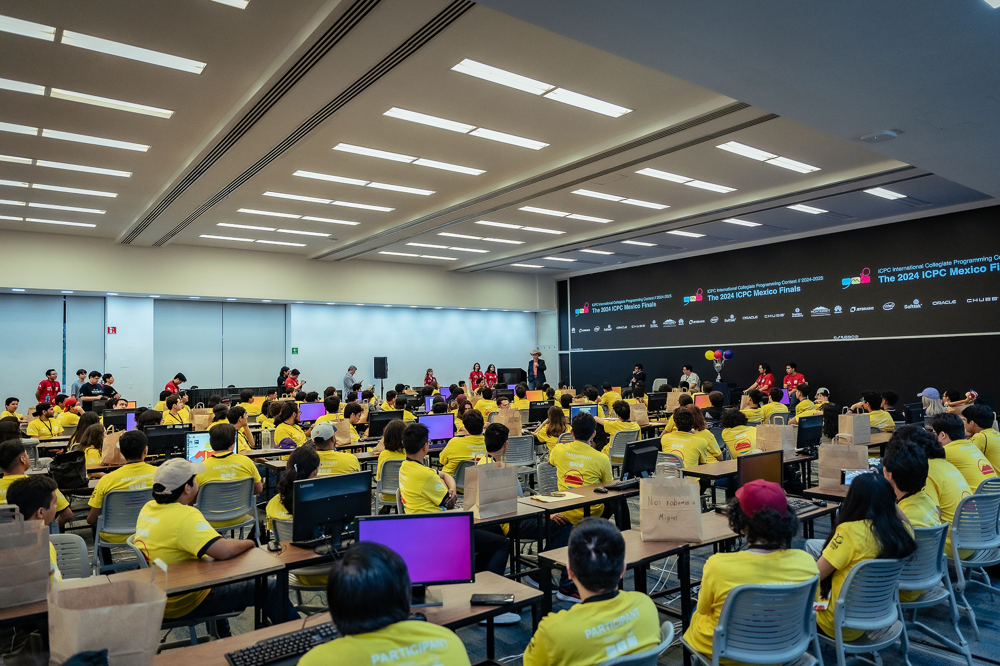

#  _Bases de Programación_

A lo largo de esta sección, nos enfocaremos en aprender conceptos clave de programación, así como la implementación de los mismos en el lenguaje C++. La razón de usar este lenguaje se debe a su eficiencia, así como al uso de herramientas y funcionalidades que nos ofrece la Biblioteca Estándar (STL). No obstante, cabe aclarar que esto no es una limitante para hacer uso de Python, Java, C o Kotlin, ya que son los lenguajes permitidos para el ICPC.  
Este enfoque forma parte de la preparación de los integrantes de futuros equipos que se planea representen a la UAM-Iztapalapa en la competencia ICPC, con el objetivo de desarrollar sus habilidades técnicas y de trabajo en equipo, que son cruciales durante la competencia.  
Sin más que agregar, esperamos que el material sea de tu agrado. En caso de que desees realizar alguna aclaración o sugerencia de mejora, nuestros canales de contacto estarán siempre disponibles para atender tus inquietudes.  

Contenido de la sección:

<ol>
    <li><a href="./estructuraB.md">Estructura basica de un programa y compilacion.</a></li>
    <li><a href="./tiposDeDatos.md">Tipos de datos.</a></li>
    <li><a href="./in-Out.md">Entrada/Salida y subida a un juez online.</a></li>
    <li><a href="./condicionales.md">Estructuras condicionales</a></li>
    <li><a href="./ciclos.md">Ciclos</a></li>
    <li><a href="./arreglos.md">Arreglos y matrices</a></li>
    <li><a href="./vectores.md">Vectores y Strings</a></li>
    <li><a href="./funciones.md">Funciones</a></li>
    <li><a href="./barridos.md">Barridos</a></li>
</ol>

