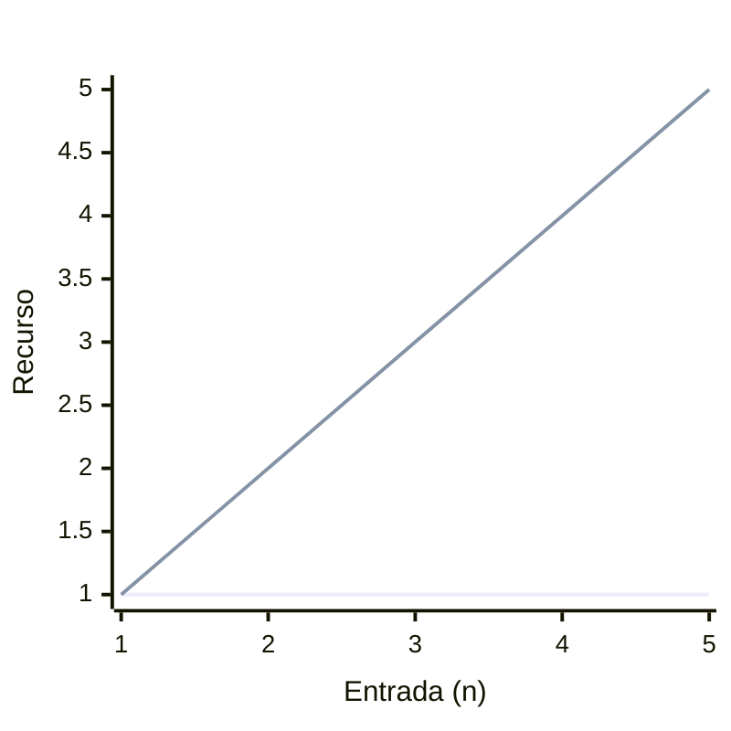

# Complejidad Algorítmica 
## Algoritmos  
Entendemos un algoritmo como _una serie de pasos o instrucciones finitas que nos ayudan a obtener un resultado específico_. Los ejemplos más comunes para entender esto serían:

La serie de pasos a seguir para llegar a un lugar determinado.
Cómo preparar un sándwich.
En ambos casos, obtenemos un resultado (llegar al lugar o tener un sándwich).
En programación, podemos tener varias formas de resolver un problema, por lo que nuestros algoritmos deben ser _eficaces_. Sin embargo, a veces los algoritmos que creamos no son _eficientes_...


```admonish info title='**_Eficiencia_ != _Eficacia_**'
Mientras que la _eficacia_ es la capacidad de un algoritmo para resolver un problema de manera correcta, la eficiencia hace referencia a la cantidad de recursos utilizados para resolverlo.  
Por ejemplo, es más _eficiente_ un algoritmo que realiza una cantidad constante de operaciones que uno que realiza una cantidad proporcional a _n_ operaciones.

```

Pero, **¿cómo conocemos la eficiencia de un algoritmo?** Bueno, para esto, en las ciencias de la computación tenemos lo que llamamos:

## Notación Asintótica

La Notación Asintótica es la manera de expresar y analizar la eficiencia (especialmente temporal y espacial) de un algoritmo en función de una entrada _n_. Es decir, describe cómo se comporta la función _T(n)_ de algún recurso, para conocer cuánto de este recurso se utiliza. Por lo que para expresar el comportamiento de _T(n)_  utilizamos las siguientes **notaciones asintóticas**:

|Notación|Características |Definición Formal|
|----|----|----|
| $$O(n)$$|Estima el uso del recurso en el peor de los casos.|$$T(n) = O(g(n)) \Longleftrightarrow c g(n) \geq T(n), c>0$$|
| $$o(n)$$|Estima el crecimiento de un algoritmo en el mejor caso, pero de forma estricta.|$$T(n) = o(g(n)) \Longleftrightarrow c g(n) > T(n), c>0$$|
| $$\Theta (n)$$|Estima el uso del recurso en el caso promedio.|$$T(n) = \Theta (g(n)) \Longleftrightarrow c_1g(n) \leq T(n) \leq c_2g(n), c>0$$|
| $$\Omega (n)$$|Estima el uso del recurso en elmejor de los casos.|$$T(n) = \Omega (g(n)) \Longleftrightarrow T(n) \geq cg(n), c>0$$|
|$$\omega (n)$$ |Estima el crecimiento de un algoritmo en el peor caso, pero de forma estricta.|$$T(n) = \omega (g(n)) \Longleftrightarrow T(n) > cg(n), c>0$$|


```admonish warning title='Cuidado'
No olvides que son _notaciones_ que nos ayudan a describir el comportamiento asintótico de un algoritmo, por lo que **NO** debemos de confundirlas con funciones.  
De igual forma, podemos señalar que igualar estas expresiones como \\(T(n) = O(n^2)\\) es  un abuso de lenguaje, es decir, que la complejidad sea de \\(O(n^2)\\) no implica que su comportamiento sea exactamente igual a \\(n^2\\), estas notaciones solo nos ayudan a tener una idea del comportamiento general del algoritmo.
```

Dado que nos concentramos en programación competitiva, haremos un énfasis especial en la **notación O Grande (_Big O notation_)**, especialmente en el contexto de **tiempo** y **memoria**. Esto se debe a que, en las competencias, el tamaño de las entradas n suele ser muy grande, lo que afecta directamente la eficiencia de nuestro programa. Además, existe un límite de tiempo (en segundos) para cada caso de prueba. Por ello, es conveniente calcular, de forma teórica, cuánto tiempo tomaría o cuánta memoria consumiría nuestro algoritmo con la entrada más grande posible.

Asimismo, debemos tener en cuenta que un juez virtual suele realizar aproximadamente \\( 10^8 \\) operaciones por segundo, lo que nos ayudará a estimar si nuestro algoritmo es lo suficientemente eficiente para cumplir con los límites de tiempo establecidos.



## Algunos ejemplos

<p style="font-size: 40px">
    Aquí habrá ejemplos en cuanto encuentre uno bueno.<br><br>
    
</p>